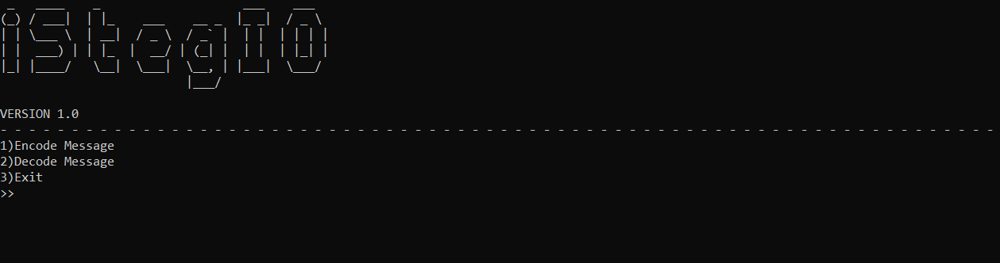

<h1>iStegIO</h1>
iStegIO is an easy to use python script / program used to hide Text messages within PNG images.The picture or photo mainly consists of pixels (r,g,b) which in turn is represented by eight bits.Our goal is to modify the <em>"Least Significant Bit"</em>, so that it may not be much noticeable. This type of steganography is called LSB(Least Significant Bit) stagnaography.After appending the text message/data we will also insert a delimiter of fifteen ones and a zero to mark the ending. This proect has been inspired from <b>@edureka</b>. In order to make things simple, I have made this, a menu driven program rather than the conventional command line arguement program, and also added some encryption decryption mechanism to it.

<h2>Requirements</h2>
<ul><li>
PILLOW library (For working with Images)</li>
<li>Pyfiglet (For ASCII art).</li></ul>

To install the requirements we can use the command <b>pip install -r requirements.txt</b>

<h2>Features</h2>
<ul>
  <li>Easy to Use.</li>
  <li>Secure.</li>
  <li>Optional Password Protection.</li> 
</ul>

<h2>How to use it ?</h2>
<ul>
  <li>Encoding -> To encode a text message/text file to PNG image we first need to select an image using the file dialog, then we have to enter a text message/select a 
  text file(using the !txt to select text files). After that, we can enter a password if we want to, otherise just skip it(Press enter).Finally just enter the name of the stegofile object, which in turn will be a PNG file.</li>
  <li>Decoding -> To decode a text message/text file from a PNG image, we just have to select the stegofile object(PNG) and have to enter a password, if it was set in the first place.Finally choose a location to save the output text file.</li>
</ul>

